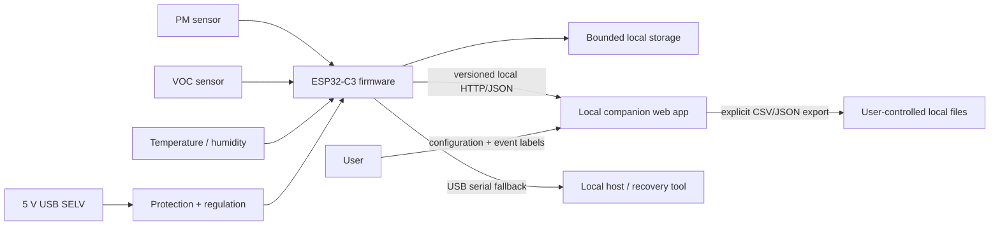

# Bench Breathe — Implementation Plan

## Baseline status

The MVP requirements and safety boundaries are locked in `hardware/requirements.md`. This plan assigns subsystem ownership and evidence gates; it does not claim that hardware, firmware, the companion app, or a physical prototype already exists.

## System architecture

Bench Breathe has three implementation layers and one shared contract:

1. **Hardware platform** — USB 5 V SELV input, protection/regulation, ESP32-C3 module, sensor interfaces, local status/input, debug access, test points, PCB, and enclosure interfaces.
2. **Device firmware** — sensor drivers, deterministic acquisition, quality states, bounded local retention, atomic configuration, local protocol server, serial recovery/export, and reset behavior.
3. **Companion web app** — local setup, status/history visualization, event annotation, configuration, explicit export, and user-facing advisory/safety language.
4. **Versioned protocol contract** — the current `docs/protocol.md` Draft v0 is the seed for data shapes, units, validity, errors, limits, authorization, and compatibility rules. Issue #7 must finalize it before firmware/app integration; ownership is shared across firmware and app changes.

### Boundary rules

| Boundary | Producer owns | Consumer owns | Shared checks |
|---|---|---|---|
| Sensors → firmware | Electrical interface and datasheet-qualified signal behavior | Driver cadence, conversion, warm-up/fault handling | Pinout, voltage, bus, timing, and invalid-data tests |
| Firmware → storage | Record schema and commit/rollover behavior | N/A (device-local) | Capacity calculation, reset/power-loss recovery |
| Firmware → app | Versioned API/serial contract, units, limits, status/error responses | Rendering, input validation, retries, accessible user messaging | Contract fixtures and offline behavior tests |
| App → export file | Requested range and user action | File creation/download and presentation | CSV/JSON fixture round trips |
| User → device | Physical setup/reset action | Explicit confirmation and feedback | Setup timeout, reset, and recovery tests |

The firmware remains authoritative for sensor state, timestamps, retained records, configuration limits, and device health. The app must not infer missing values as zero or invent undocumented endpoints. The hardware must not depend on firmware to make a hazardous-voltage situation safe because hazardous-voltage interfaces are outside project scope.

### Companion deployment and local access

The MVP companion is compiled to static assets and served directly by the device. This makes the browser UI and API same-origin and keeps normal operation independent of an internet host or separately installed server. A sustained physical-button action opens a visibly indicated setup window for at most 10 minutes and reveals a single-use, >=128-bit random pairing code over the physically connected USB serial link. The otherwise unauthenticated same-origin pairing endpoint accepts that code only during the window; its first successful exchange returns the per-device API credential, consumes the code, and closes the endpoint. Static assets and minimal non-sensitive health may remain public, but every other API resource requires the credential. State-changing requests also receive same-origin request protection, and USB-serial mutations require a separate recent physical confirmation. The MVP uses local HTTP rather than claiming LAN confidentiality: setup documentation must state that it is for a trusted private LAN only and must not be exposed through port forwarding.

`docs/protocol.md` is still Draft v0. Its endpoint list is planning input, not a finalized wire contract; issue #7 owns the exact request/response schemas and app implementation after the access and deployment constraints above are preserved.

## Technology choices and rationale

- **Controller baseline:** ESP32-C3 module family for local Wi-Fi, USB/serial-capable development paths, cost, and ecosystem. Exact MPN remains a datasheet-backed selection task.
- **Firmware:** C/C++ with a pinned PlatformIO environment and selected ESP-IDF/Arduino framework, chosen during firmware setup and then locked for reproducibility.
- **Sensors:** dedicated PM channel plus VOC and temperature/humidity context, selected against cadence, warm-up, power, airflow, lifecycle, and calibration requirements.
- **Companion app:** TypeScript + Vite local web app for phone/desktop browsers without app-store or cloud-account dependency.
- **Data:** versioned JSON for API/config/state, CSV and JSON for explicit export, bounded device-local retention.
- **Hardware CAD:** editable KiCad project, schematic, and PCB are the hardware source of truth. Manufacturer/MPN properties in the schematic are the BOM source of truth.

## MVP requirements summary

The normative details and acceptance evidence are in `hardware/requirements.md`. Key frozen constraints are:

- USB 5 V SELV only; no mains, relay, actuator, or USB-PD behavior.
- <=250 mA steady-state target and <=500 mA peak input limit.
- PM2.5, VOC proxy/index, temperature, and relative humidity with explicit quality state.
- Default 2 s acquisition tick; configurable 2–60 s.
- Minimum 24 h of 2 s trend records and 30 days of 5 min aggregates/equivalent bounded summaries.
- Offline acquisition and storage; versioned local HTTP/JSON plus USB serial fallback.
- No cloud account, mandatory internet, outbound cloud telemetry, or hidden cloud dependency.
- Advisory trend language only; no certified exposure, medical, emergency, or safe/unsafe claim.
- Prototype BOM target USD 35–60, ceiling USD 75 under the exclusions in `CST-01`.

## Milestones and dependency order

| Milestone | Scope | Exit evidence | Status |
|---|---|---|---|
| M1 — Requirements and risk baseline | Measurable requirements, architecture, safety, risk register | Cross-document review against issue #1 | Baseline documented; implementation evidence not started |
| M2 — Component selection | Select exact controller/sensors/power/protection parts and populate Manufacturer/MPN | Manufacturer datasheets cached; pin/electrical decisions cited | Not started |
| M3 — KiCad schematic | Editable project and complete schematic | ERC output, analyzer output, documented exceptions | Not started |
| M4 — BOM export | Generate source-of-truth tracking BOM | `bom/bom.csv` regenerated from schematic properties | Not started |
| M5 — PCB layout | Place/route board, keepouts, thermal/current paths | DRC and applicable layout analyzer evidence | Not started |
| M6 — Firmware baseline | Repeatable build/flash, acquisition, quality states, retention, protocol | Unit/contract tests plus documented hardware smoke-test boundary | Not started |
| M7 — Companion app | Setup, status/history, event tags, config, export | Build/lint/tests and protocol fixtures | Not started |
| M8 — Integration and bring-up | Assemble and exercise a named prototype revision | Static, simulation, and bench evidence kept distinct | Not started |
| M9 — Mature fabrication/release bundle | Fabrication files, BOM, assembly/bring-up docs, source archive | Regenerated artifacts and release checklist | Not started |

M2 depends on M1. M3 depends on M2. M4 depends on M3. M5 depends on M3 and M4. M6 may begin after M2 but hardware claims wait for M3/M5. M7 may scaffold after the protocol boundary is stable, but integration closes only with M6. M8 and M9 depend on all applicable earlier evidence.

## Testing and evidence strategy

- **Requirements/docs:** exact requirement IDs, architecture ownership, safety wording, milestone consistency, and risk mitigations reviewed together.
- **Hardware static:** manufacturer-datasheet pin/electrical checks, ERC, PCB DRC, cross-domain analyzers, BOM regeneration, and fabrication-output inspection.
- **Simulation:** power/transient/thermal or other models where applicable, with assumptions and limitations recorded.
- **Firmware:** pinned build, unit tests for parsing/aggregation/retention/time correction, protocol fixtures, and fault injection for interrupted writes.
- **App:** lint/build/unit tests, accessibility review, invalid/missing-data handling, destructive-action confirmation, and export fixtures.
- **Integration:** offline operation, LAN loss, serial recovery, setup timeout, sensor warm-up/fault, bounded rollover, power interruption, and clock correction.
- **Bench:** current waveform, rail checks, sensor communications, airflow/thermal interaction, and response comparisons on a named hardware revision.
- **Field:** optional representative observations only; never presented as calibration, certification, or evidence that an environment is safe.

## Risk register

| ID | Risk | Likelihood | Impact | Mitigation | Evidence gate |
|---|---|---:|---:|---|---|
| R-01 | Sensor warm-up, drift, contamination, or cross-sensitivity creates false confidence | High | High | Expose quality/warm-up state; use trend/proxy language; follow datasheet conditioning; document placement and maintenance | Datasheet review, quality-state tests, bench comparison |
| R-02 | PM airflow path or enclosure heat biases readings | Medium | High | Separate heat sources from sensing path; preserve airflow; compare open-bench and enclosure behavior | PCB/enclosure review and thermal/response bench test |
| R-03 | Radio plus sensor startup exceeds USB/current regulator capacity | Medium | High | Budget worst-case current and margin; sequence startup if required; measure peak current and brownout | Power analysis, simulation where useful, bench waveform |
| R-04 | Power loss corrupts configuration/history | Medium | High | Atomic records, checksums/versioning, deterministic recovery, oldest-first rollover | Fault-injection and reboot tests |
| R-05 | LAN setup or discovery prevents practical use | Medium | Medium | Time-bounded visible setup mode; retain USB serial setup/recovery/export | Offline/setup/serial integration tests |
| R-06 | Local HTTP service is exposed beyond the intended trusted LAN | Medium | High | Device-hosted same-origin UI; per-device credential issued only in a physical setup window; authorization on all non-minimal resources; physical confirmation for serial mutations; no cloud listener; document cleartext-LAN residual risk and prohibit port forwarding | Authorization/cross-origin tests, network capture, user documentation |
| R-07 | App/firmware protocol drift breaks setup or export | Medium | High | One versioned contract, shared fixtures, breaking-version rule | CI contract tests for both implementations |
| R-08 | Flash endurance or capacity fails retention targets | Medium | Medium | Capacity/endurance calculation, batching/wear strategy, bounded aggregates, accelerated rollover test | Design calculation and firmware storage test |
| R-09 | Sourcing changes invalidate pinout, package, or recommended circuit | Medium | High | Exact Manufacturer/MPN in schematic, cached datasheets, lifecycle/alternate review, no family-only substitution | BOM/datasheet gate before schematic and fabrication |
| R-10 | Documentation implies certified exposure or safety protection | Medium | High | Mandatory advisory wording, prohibited claims, copy review, no automatic control | README/app/release copy review |
| R-11 | USB connector or cable mechanical load damages the board | Medium | Medium | Anchored connector footprint, enclosure strain relief, known-good cable in bring-up | DRC, mechanical inspection, insertion test |
| R-12 | Project reports generated/static evidence as physical validation | Medium | High | Label static/simulation/bench/field evidence separately and bind bench evidence to revision/equipment | Release checklist and PR review |

A risk may be accepted only with a written rationale and residual-risk statement. Missing evidence leaves the related milestone open; it is not converted to a pass by documentation alone.

## Packaging and release policy

- Firmware releases include source, pinned build inputs, binaries only when reproduced, flashing/recovery instructions, and protocol version.
- Companion releases include source, dependency lockfile, reproducible static build instructions, and local-data/export behavior.
- Hardware releases include editable KiCad sources. Gerber, drill, CPL, and BOM files are generated only at the relevant maturity gate.
- `bom/bom.csv` is exported from KiCad schematic properties; preliminary planning spreadsheets are not production BOMs.
- Release notes state which evidence classes were actually completed. No physical-test claim is made until a named prototype is measured.

## Safety and product-claim boundary

Bench Breathe remains SELV/USB-only and advisory. It shall never control mains equipment, ventilation machinery, relays, or safety interlocks. It shall not be presented as a medical device, emergency alarm, industrial hygiene instrument, or guarantee of acceptable exposure. Users must follow material/tool guidance and appropriate ventilation/PPE practices independently of device output.
